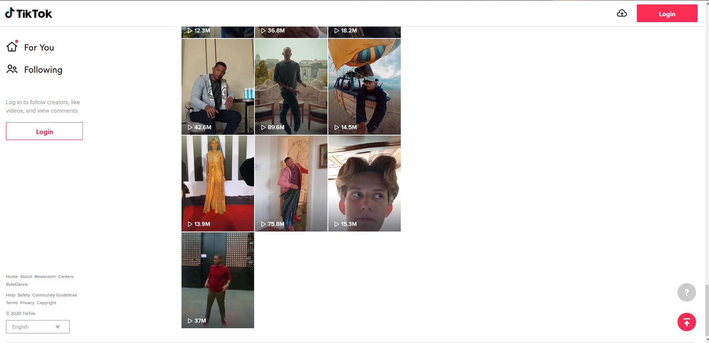
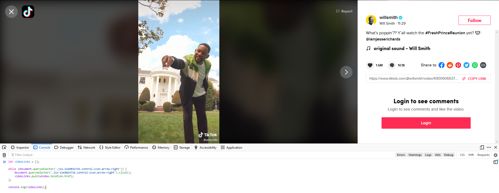
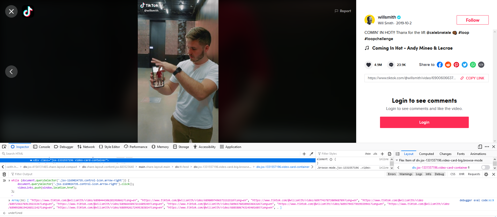
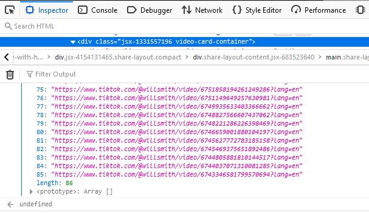
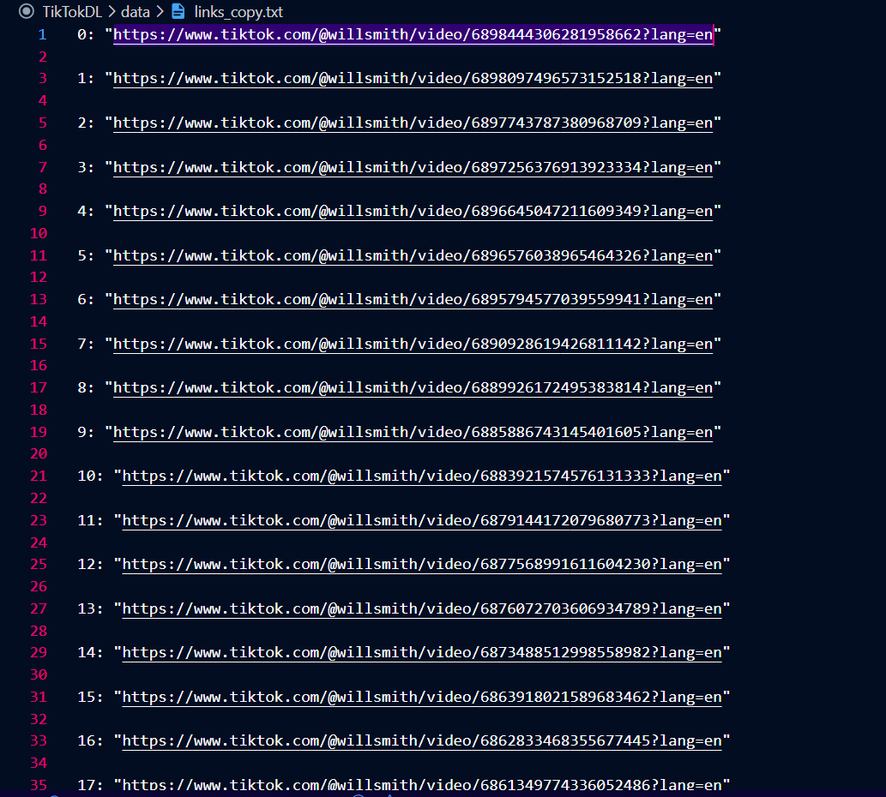
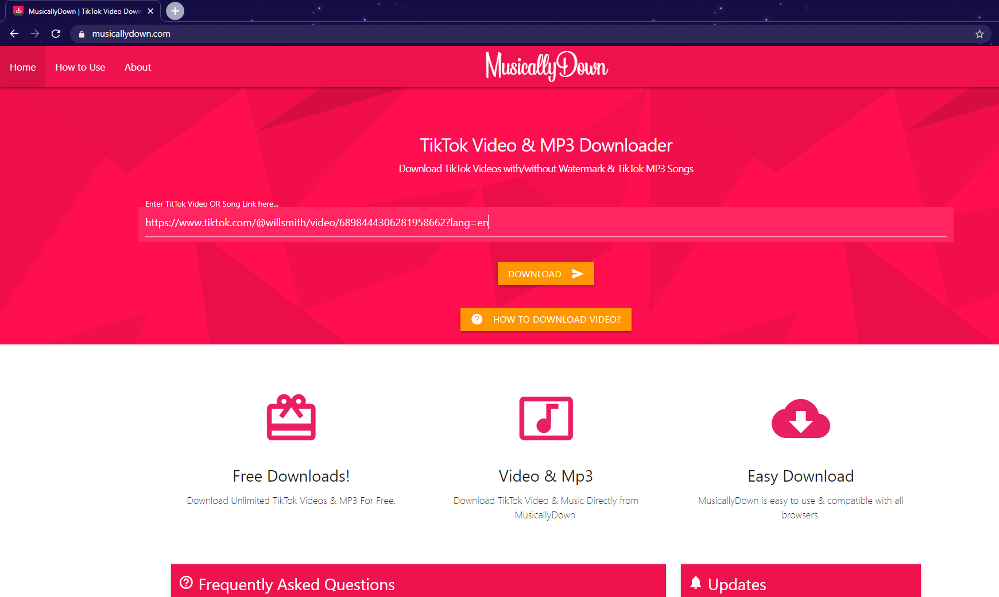
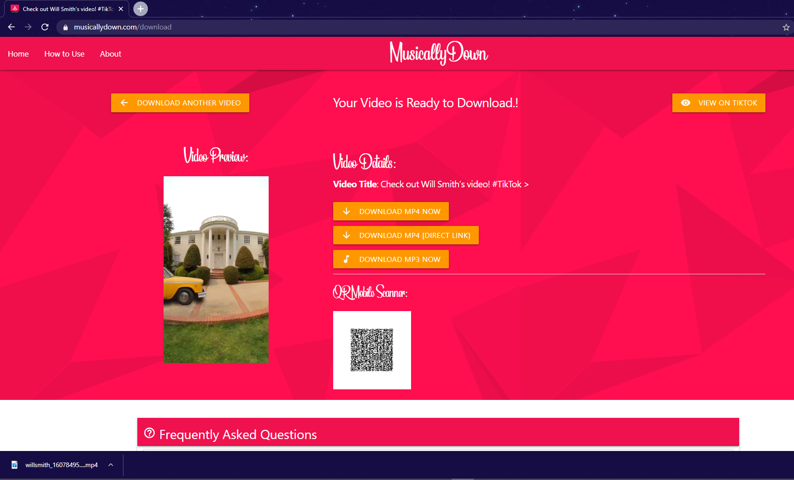

# TikTokDL (Deprecated)
This project was created to automate the process of going through a TikTok profile's entire library of public videos and downloading them. The project was created as an emergency method in lieu of the United States government announcing that the app would no longer be available through app stores. I used the script to download all of the videos for a family member in case she were to lose access to her profile post app store removal. As of (12/13/2020) the scripts still work as intended, however this project is not getting ongoing support.

The process below assumes some familiarity with programming, such as how to use a web browser's development console and how to execute a Python script. I'm making this assumption on the grounds that the scripts aren't important enough to actually run and/or will likely be outdated in a short time. The explanation below is moreso to get a basic idea of this project. Note: TikTok has a feature that tries to make it hard for bots to scrape their site, so I had to find a quick and dirty workaround which led to more of a "semi-automated" process as opposed to being completely automated.

## Process (using a web browser)
* First, the user visits their desired user profile.

* Next, the user scrolls to the bottom of the user's TikTok profile such that references to each of their videos has been rendered to the screen. Theoretically this prerenders/preloads the videos which ensures the "pasteInConsole" script only has to run once (it'll make more sense later).

### The bottom of Will Smith's TikTok page

* Then the user clicks on said profile's first video.

* Now the user must confirm the presence of a clickable "right arrow" button over the video, if not present, reload page and enlarge browser window (a clickable arrow shaped button for alternating videos must be visible. That arrow is what the scripts use to automate cycling through the videos).

* Next the user copies and pastes the "pasteInConsole" script into web browser's dev console.
### Will Smith's most recent TikTok

* Once pasting the script, execute the script by pressing the 'Enter' key while in the dev console.

* The script will then automatically cycle through the user profile and print links to each video in the console (Note: if the script doesn't grab each link, revisit the user's profile, preload their videos and try again). 
### Will Smith's oldest TikTok

### Links for 86 of Will Smith's TikToks (count starts at 0)

* Copy and paste said links into a "links.txt" file (view "links.txt.example to see what logs and links.txt should look like").

* Now execute the "main.py" script and the script will visit https://musicallydown.com/ to then download each of the user's videos (Note: "main.py" uses "./chromedriver.exe" to work, which needs to be up-to-date with the version of Chrome installed on your computer).

*Thank you for your interest.*